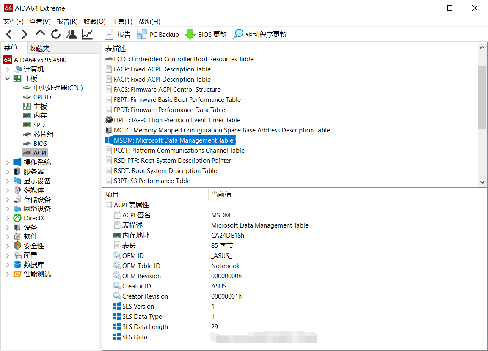

## 3、Windows10系统激活、版本转换与KMS密钥 {#3-windows10-kms}

提示：请先判断好自己的需求以及情况，或者与IT侠交流帮助分析。**记住，只要你曾经拥有过正版的Windows 10，99%能弄回来正版纯净的Windows 10，维修店如果说他没正版只能给你装其他版本，请小心；维修店里重装系统最多只应该收少量手续费（自行斟酌），交多了无异于智商税……**

**迷你指南：@**

**a、电脑本身就是Windows，想重装或者换版本的：请从3.1开始阅读至3.3**

**b、电脑已经装完Windows系统不知道怎么激活的：请阅读3.2、3.3**

**c、各种后来装的双系统或者虚拟机要激活，请直接阅读3.3**

### 3.1、几种情况的特别说明 {#3-1}

如果要自行安装Windows，请阅读以下表格，将**极大方便激活**。以下均假设阅读者只有**基本的“激活”需求而非高级功能**。

| **买来的系统** | **现在的系统** | **想装的系统** | **推荐选择** |
| --- | --- | --- | --- |
| Windows 7/8/8.1 | Windows 7/8/8.1 | Windows 10 | Windows 10 企业版、教育版、专业版|
| Windows 7/8/8.1 | Windows 10 <br>（通过免费自动升级） | Windows 10 | 与现在的系统版本一致 |
| Windows 7/8/8.1 | Windows 10 <br>（后期找人安装）| Windows 10 | Windows 10 企业版、教育版、专业版|
| Windows 10 | Windows 10 | Windows 10 | 与买来的系统版本一致 |
| Windows 10 | Windows 7/8/8.1 | Windows 10 | 与买来的系统版本一致 |
| Windows 10 | 任意系统 | Windows 7/8/8.1 | 非常不推荐 |

如果不能确定自己是不是永久激活的Windows10，可以**win + R，输入 “slmgr.vbs /xpr”**或者可以在当前Windows版本查看：**设置-更新与安全-激活**。除Windows版本外，该页面还有激活方式的信息，该信息十分重要，常见的含义如下：

| **激活信息** | **Windows版本** | **含义** |
| --- | --- | --- |
| 通过组织服务的激活器激活 | Windows 企业版、教育版、专业版| 使用了批量激活，180天过期；<br> 学校购买，可用学校kms激活；<br> 这个情况的专业版是Business版本|
| 通过组织服务的激活器激活 | Windows 家庭中文版 | 使用了批量激活，45天过期；<br> **这是不正常的激活方式**；<br> 请尽快问清楚售后乃至维权 |
| 使用数字权利激活 | Windows 专业版、家庭中文版 | 永久激活，<br> Windows 7/8/8.1 升级上来的Windows 10，且没有登录微软账号; <br> 或者是刚买的新电脑,没有登录微软账号; <br> 这个情况的企业版是 Retail 版本 |
| 使用与Microsoft账户绑定的 <br> 数字许可证激活 | Windows 专业版、家庭中文版 | 永久激活<br> Windows 7/8/8.1 升级上来的Windows 10,且登录了微软账号; <br> 或者是刚买的新电脑,登录了微软账号; <br> 或者是自己购买并且激活了正版Windows10; <br> 总之在此台电脑相同版本Windows 上登录当前登录的微软账号可以直接激活,恭喜! |
| 其他情况 |  | 比较少见，目前没有遇到过正常用户会遇到其他情况 |

### 3.2、数字权利激活问题 {#3-2}

**参见3.1的第二个表格，**如果没有显示**“与Microsoft账户绑定的数字许可证激活”**而是**“数字权利激活”**，可以登录你的微软账户以便进行绑定，这样只要未发生重大硬件改动，重装相应版本登录账户即可直接激活！

**准备一个8G U盘，前往** [下载Windows10](https://www.microsoft.com/zh-cn/software-download/windows10)，**一键制作装机盘（或者直接运行安装），不需要去维修店花钱！**

如果发生**硬件改动**无法用此方法激活，请参考在更换硬件后重新激活 Windows 10。

### 3.3、KMS软件激活问题 {#3-3}

批量激活（Business）版本（**如果已经装了就跳过这段，确定可以用学校批量激活的版本为专业版、企业版、教育版）** 的Windows10可以在[学校KMS网站](http://kms.nju.edu.cn) **（版本比较旧，校园网才能访问）** 下载，亦可以 **直接下载纯净的镜像（比较新）**，推荐使用[MSDN，我告诉你](http://msdn.itellyou.cn/)。

**在校内KMS网站下载完后运行激活程序出问题时，请依次确认以下几点：**

1.  是否以 **管理员身份（参看0.3）** 运行激活程序（如NJU.KMS.WIN10.bat）
2.  电脑是否连接在 **校园网（NJU-WLAN或宿舍校园网（普天）接口** 而非运营商网络或者移动热点）下（无需登录认证网页）
3.  下载的.bat文件是否是 **对应资源区域的“激活程序下载”** 中下载的（通常 **下载win10系统激活的.bat文件** 可以激活当前所有可下载的版本）。

若上述检查已确认正常，请读一下错误提示信息，若有“激活服务器确定指定的产品密钥被阻止”的字样，请 **参看3.4**，通过 **更改密钥**来使用学校的KMS服务器激活 **（特别是教育版）**。

### 3.4、Windows10各版本的GVLK（批量激活）设置密钥 {#3-4}

注意，此表的密钥**不是激活密钥**，而是**设置密钥**，可以正确的设置系统版本**用于KMS激活**。

| Windows 10 专业版 | W269N-WFGWX-YVC9B-4J6C9-T83GX |
| --- | --- |
| Windows 10 企业版 | NPPR9-FWDCX-D2C8J-H872K-2YT43 |
| Windows 10 教育版 | NW6C2-QMPVW-D7KKK-3GKT6-VCFB2 |

手机请向右滑动表格查看密钥

打开**设置-更新与安全-激活**，选择“**更改产品密钥**”，然后**输入对应版本的密钥**，在弹出的窗口中点击激活，或者**用KMS软件激活**

**特别强调，学校正版的KMS激活（截至目前）只能激活以上三个列出版本（企业版不含LTSB、LTSC等等），请注意安装的系统镜像是什么版本。**

**不过不排除个别奇葩版本也是可以的（可以打电话问问网络中心2333），详情请去微软官网查找：**

[各版本Win10 GVLK对应的密钥](https://docs.microsoft.com/en-us/windows-server/get-started/kmsclientkeys)

**_注意：_**输入与当前Windows版本不相符的密钥将无法正确激活，查看Windows版本的方法请**参看0.6**

**_注意：_**可以**通过密钥输入来转换Windows10版本**。但是版本不是随意转换的，有的必须要全部重装系统。能够升级降级的版本转换按照该页面给出的表格进行：[Windows 10 升级路径](https://docs.microsoft.com/zh-cn/windows/deployment/upgrade/windows-10-upgrade-paths)

### 3.5、查看本机密钥 {#3-5}

查看安装在本电脑上**当前系统**的产品密钥：

*   打开命令指示符，输入 `` regedit ``，在地址栏中的”计算机”处输入（复制）以下内容：
    ``` HKEY_LOCAL_MACHINE\SOFTWARE\Microsoft\Windows NT\CurrentVersion\SoftwareProtectionPlatform ```

回车后在主窗口中有 `` BackupProductKeyDefault ``，可以查看到默认备份密钥。

获得**出厂密钥**（重装当前系统可以直接重新激活，所以非常重要）

*   按Win+X键，打开PowerShell（管理员），输入：
    ``` wmic path SoftwareLicensingService get OA3xOriginalProductKey ```

回车，此为写在主板上的密钥！

*   运行 AIDA64，找到打码的位置即可
    
*   打电话问电脑厂商客服，在客服指引下查看贴在机器外表面的产品密钥。
